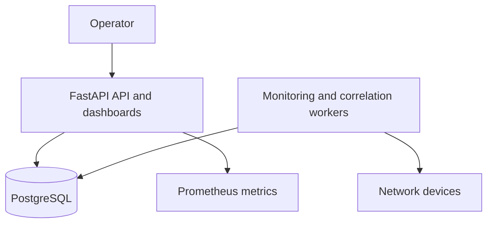

# NetPulse Network Observability Platform

NetPulse is a network observability platform built with FastAPI, PostgreSQL, Prometheus metrics, SNMP monitoring and Docker.

It collects network signals, evaluates infrastructure health, detects anomalies, deduplicates alerts and correlates related events into operational incidents.

> **Project status:** Active development. NetPulse is suitable for local evaluation and portfolio demonstration, but it is not yet considered production-ready.

## Highlights

* JWT authentication and role-based access control
* Network device management
* ICMP and SNMP monitoring
* Prometheus metrics
* Alert detection and deduplication
* Incident management and timelines
* Explainable alert correlation
* Network quality and risk analytics
* WebSocket updates
* Operational dashboards
* PostgreSQL persistence and Alembic migrations
* Docker Compose development environment
* Automated tests and GitHub Actions
* CodeQL and dependency monitoring

## Why NetPulse?

Traditional monitoring tools often produce many isolated alerts for a single network failure. NetPulse attempts to turn those signals into useful operational context.

A typical event moves through the following lifecycle:

```text
Network signal
    |
    v
Metric or event
    |
    v
Alert detection
    |
    v
Deduplication
    |
    v
Correlation decision
    |
    v
New or existing incident
    |
    v
Operational dashboard and metrics
```

## Architecture


```mermaid
flowchart TD
    User["Operator"]
    API["FastAPI API and dashboards"]
    DB[("PostgreSQL")]
    Monitor["Monitoring and correlation workers"]
    Metrics["Prometheus metrics"]
    Devices["Network devices"]

    User --> API
    API --> DB
    Monitor --> DB
    Monitor --> Devices
    API --> Metrics
```

The FastAPI application currently serves both the API and the operational portfolio dashboards. A standalone React frontend is planned but is not currently included in the Docker Compose stack.

## Technology Stack

### Backend

* Python 3.12
* FastAPI
* SQLAlchemy
* Alembic
* Pydantic
* PostgreSQL
* Uvicorn

### Monitoring and observability

* PySNMP
* ICMP monitoring
* Prometheus client
* WebSockets
* Structured application logging

### DevOps and quality

* Docker
* Docker Compose
* GitHub Actions
* GitHub Container Registry
* Dependabot
* CodeQL
* Pytest

## Repository Structure

```text
backend/     FastAPI application, database models, services and tests
docs/        Architecture notes, screenshots and technical documentation
infra/       Infrastructure-related configuration
scripts/     Automation and portfolio utilities
.github/     CI workflows, templates and repository automation
```

## Quick Start

### Requirements

Install the following tools:

* Git
* Docker Desktop
* Docker Compose

### 1. Clone the repository

```bash
git clone https://github.com/edmundito012/netpulse-network-observability-platform.git
cd netpulse-network-observability-platform
```

### 2. Create the local environment file

Linux or macOS:

```bash
cp .env.example .env
```

Windows PowerShell:

```powershell
Copy-Item .env.example .env
```

Generate a secure local secret:

```bash
python -c "import secrets; print(secrets.token_urlsafe(48))"
```

Open `.env` and replace the placeholder assigned to `SECRET_KEY` with the generated value.

Never commit the `.env` file.

### 3. Start the platform

```bash
docker compose up --build
```

Docker Compose waits for PostgreSQL to become healthy, applies the Alembic migrations and then starts the API.

### 4. Open NetPulse

| Resource              | URL                                          |
| --------------------- | -------------------------------------------- |
| API root              | http://localhost:8000                        |
| Health check          | http://localhost:8000/health                 |
| Swagger UI            | http://localhost:8000/docs                   |
| ReDoc                 | http://localhost:8000/redoc                  |
| Prometheus metrics    | http://localhost:8000/metrics                |
| Portfolio dashboard   | http://localhost:8000/portfolio              |
| Correlation dashboard | http://localhost:8000/portfolio/correlations |

Some portfolio routes may depend on seeded or previously collected data.

### 5. Stop the platform

```bash
docker compose down
```

To remove the local PostgreSQL volume as well:

```bash
docker compose down --volumes
```

> Removing the volume permanently deletes the local NetPulse database.

## Local Backend Development

Create and activate a Python virtual environment.

Windows PowerShell:

```powershell
cd backend
python -m venv .venv
.venv\Scripts\Activate.ps1
uv sync --locked --all-groups
```

Linux or macOS:

```bash
cd backend
python -m venv .venv
source .venv/bin/activate
uv sync --locked --all-groups
```

Set the required environment variables, apply migrations and start the application:

```bash
uv run alembic upgrade head
uv run uvicorn app.main:app --reload
```

The backend will be available at:

```text
http://localhost:8000
```

## Testing

Run the complete backend test suite inside Docker:

```bash
docker compose exec backend python -m pytest
```

Run a specific test:

```bash
docker compose exec backend python -m pytest tests/path_to_test.py -v
```

The repository currently reports:

```text
354 passed
```

This value is generated from the automated project evidence and may change as the project evolves.

## Health and Metrics

### Health endpoint

```http
GET /health
```

The health response includes information about:

* application status;
* PostgreSQL connectivity;
* scheduler status;
* dashboard cache state;
* device-state cache.

### Prometheus endpoint

```http
GET /metrics
```

The endpoint exposes application and correlation-engine metrics in Prometheus format.

## Correlation Intelligence

The NetPulse Correlation Engine groups related network alerts into operational incidents using deterministic and explainable scoring.

Each decision can result in:

* matching an existing active incident;
* creating a new incident;
* taking no operational action.

The engine includes:

* signal classification;
* temporal correlation;
* device and severity matching;
* deterministic correlation keys;
* persisted decision history;
* idempotent application;
* PostgreSQL advisory locking;
* bounded background processing;
* Prometheus worker metrics;
* correlation analytics.

### Correlation API

```text
GET  /incident-correlations
GET  /incident-correlations/{correlation_id}
POST /incident-correlations/evaluate/{alert_id}
POST /incident-correlations/apply/{alert_id}
GET  /analytics/correlations
```

### Correlation dashboard

```text
http://localhost:8000/portfolio/correlations
```

Technical documentation:

[Correlation Engine Documentation](docs/correlation-engine.md)


## Screenshots

### Incident Operations


### Portfolio Dashboard


### API Documentation


## Automated Project Evidence

<!-- NETPULSE:AUTO:START -->

Generated automatically from tests, commits, and screenshots.

_Last automation run: 2026-08-17 20:52 UTC_

### ✅ Automated Quality

- **Tests:** 354 passed
- **Warnings:** 2
- **CI:** GitHub Actions
- **Security:** CodeQL
- **Workflow:** Feature branch → Pull Request → CI → Merge

### 🧠 Recent Engineering Milestones

- 🐛 **ci** — run portfolio tests with uv environment
- ♻️ **api** — centralize application router registration
- 🔧 **config** — improve security and reproducibility (#31)
- 📝 **portfolio** — update automated evidence [skip readme-sync]
- 🔧 **scripts** — remove broken PowerShell finalizer
- 📝 **correlation** — document engine architecture and dashboard
- 📝 **portfolio** — update automated evidence [skip readme-sync]

### 📸 Automated Screenshots

#### Correlation Intelligence Dashboard


#### Incident Operations Dashboard


#### Portfolio Dashboard


#### Redoc Api


#### Redoc


#### Swagger Api


#### Swagger


<!-- NETPULSE:AUTO:END -->

## Security

NetPulse is currently under active development. Security fixes are applied to the `main` branch.

Do not report vulnerabilities through public GitHub issues. Follow the instructions in [SECURITY.md](SECURITY.md) and contact the maintainer privately.

Never commit:

* `.env` files;
* database passwords;
* JWT secret keys;
* Telegram credentials;
* production connection strings.

## Current Limitations

NetPulse is not yet presented as a production-ready or horizontally scalable monitoring platform.

Current limitations include:

* no standalone frontend deployment;
* no published performance baseline;
* no Kubernetes deployment;
* no long-term time-series storage strategy;
* limited real-device integration evidence;
* background workers currently share the application lifecycle;
* production availability and recovery objectives are not yet defined.

These limitations are being addressed incrementally through documented and tested changes.

## Roadmap

Near-term priorities:

* complete reproducible Docker environment;
* separate API and background-worker processes;
* version the public API;
* improve integration and migration testing;
* add a reproducible SNMP simulation laboratory;
* publish performance baselines;
* add OpenTelemetry traces;
* build a standalone React and TypeScript interface;
* add Grafana integration;
* provide Kubernetes and Helm deployment examples.

## Contributing

1. Fork the repository.
2. Create a feature branch.
3. Make a focused change.
4. Add or update tests.
5. Confirm that migrations and Docker Compose still work.
6. Open a pull request with testing and operational-impact details.

Example branch:

```bash
git checkout -b feat/example-feature
```

Use focused conventional commit messages:

```text
feat(correlation): add correlation rule
fix(alerts): prevent duplicate alert creation
test(incidents): cover concurrent incident updates
docs(architecture): document worker lifecycle
```

## License

NetPulse is licensed under the [MIT License](LICENSE).
